# MoAmri Accounting برنامج محاسبي

هذا المشروع عبارة عم مشروع Flutter لنظام محاسبي باللغة العربية

A Flutter project for accounting in arabic language

## Features المميزات

1. Printing الطباعة

     الطباعة بنوعين من الورق A4 أو roll 80mm
     print in two types of papers

2. Barcode Scanner قراءة الباركود من الفاحص

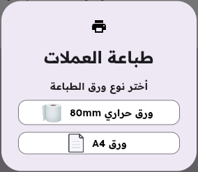

## TODO list قائمة المهام

- [x] Create store إنشاء متجر

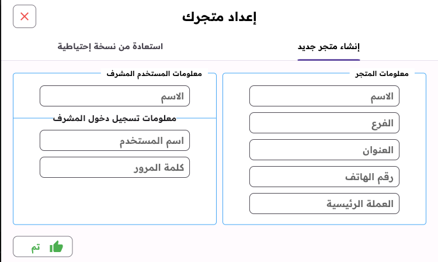

- [x] Login تسجيل دخول

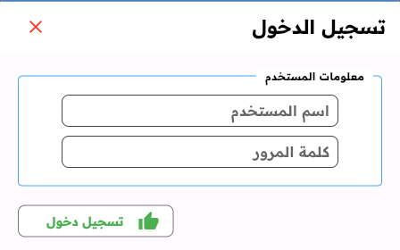

- [ ] Logout or user switch تسجيل خروج أو تبديل المستخدمين
- [x] Inventory with currencies and materials, adding, editing, delete, nad printing المخزن مع العملات والمواد, إضافةو تعديل و حذف وطباعة

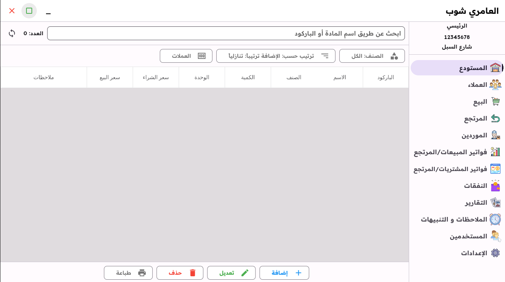
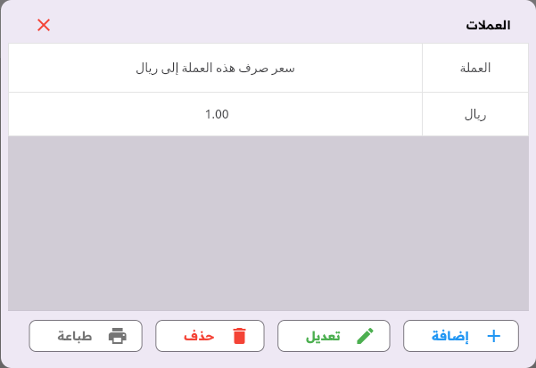
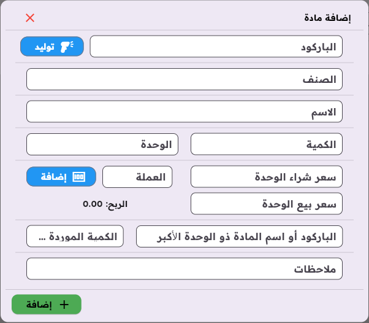

- [x] Customers, adding, editing, delete, nad printing العملاء, إضافة و تعديل و حذف وطباعة

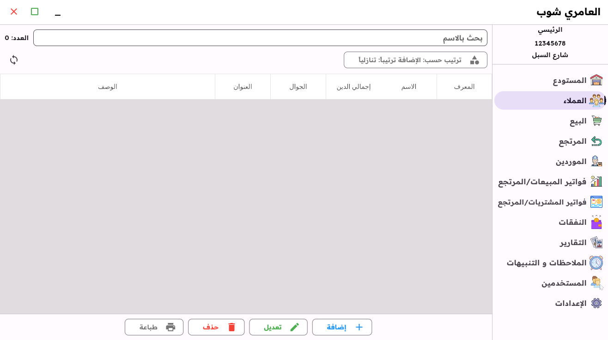
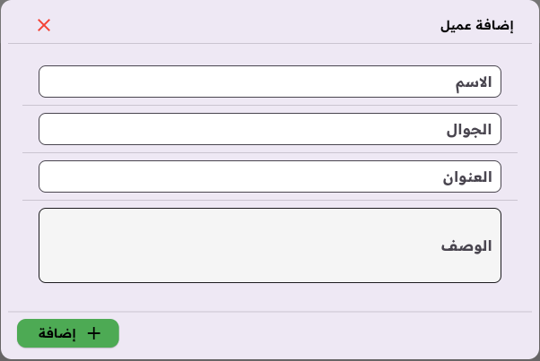

- [x] Sales البيع

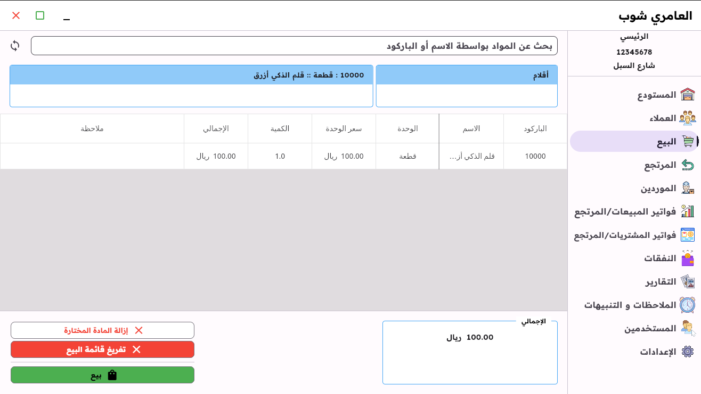
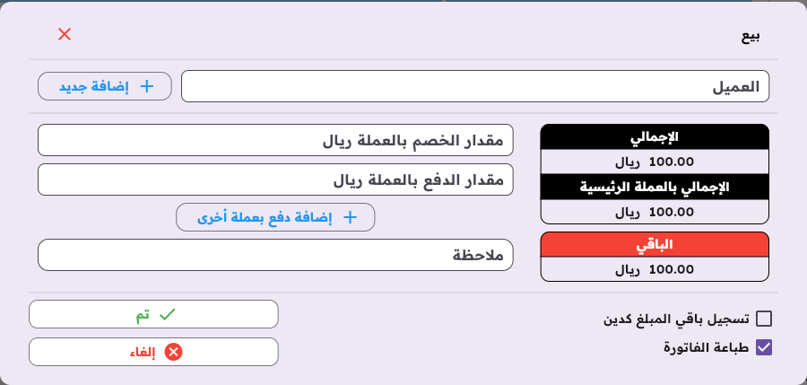

- [ ] Returns المرتجع

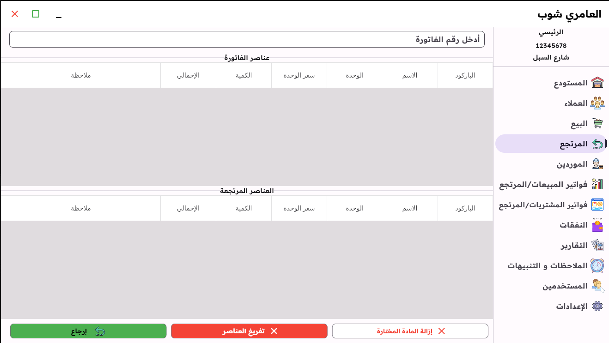

Still some work todo here
ما زال هنالك بعض العمل هنا
- [ ] complete the rest pages بقية الصفحات

---

## 🚀 GitHub Actions - CI/CD

تم إعداد GitHub Actions للبناء والتوزيع التلقائي.

### العملflows المتاحة

#### 1. CI (Continuous Integration)
- يعمل تلقائياً عند كل push أو pull request
- يقوم بتحليل الكود والتحقق من التنسيق

#### 2. Build and Release
- يعمل عند إنشاء tag جديد أو يدوياً من GitHub Actions
- يبني التطبيق لـ Linux و Windows
- ينشئ GitHub Release مع الملفات

### كيفية إنشاء Release

#### الطريقة 1: إنشاء Tag
```bash
git tag v1.0.0
git push origin v1.0.0
```

#### الطريقة 2: من GitHub UI
1. اذهب إلى **Actions** في المستودع
2. اختر **Build and Release**
3. اضغط **Run workflow**
4. أدخل رقم النسخة (مثل `v1.0.1`)

### متطلبات البناء المحلي

#### Linux
```bash
# تثبيت المتطلبات
sudo apt-get install clang cmake ninja-build pkg-config libgtk-3-dev liblzma-dev

# البناء
flutter build linux --release
```

#### Windows
```bash
# البناء
flutter build windows --release
```

---

## 📦 التثبيت والتشغيل

### المتطلبات
- Flutter SDK 3.16.0 أو أحدث
- Dart SDK

### التثبيت
```bash
# استنساخ المستودع
git clone https://github.com/NassarAlshabi1/MoAmriAccounting.git

# الدخول للمجلد
cd MoAmriAccounting

# تثبيت المتطلبات
flutter pub get

# تشغيل التطبيق
flutter run -d linux  # للينكس
flutter run -d windows  # لويندوز
```

---

## 📁 هيكل المشروع

```
MoAmriAccounting/
├── .github/
│   └── workflows/
│       ├── ci.yml           # Continuous Integration
│       └── build-release.yml # Build and Release
├── lib/
│   ├── controllers/         # متحكمات التطبيق
│   ├── database/            # قاعدة البيانات
│   ├── inventory/           # صفحات المخزون
│   ├── customers/           # صفحات العملاء
│   ├── sale/                # صفحات البيع
│   └── return/              # صفحات المرتجع
├── assets/
│   ├── fonts/               # الخطوط
│   ├── images/              # الصور
│   └── sounds/              # الأصوات
├── linux/                   # ملفات Linux
├── windows/                 # ملفات Windows
└── pubspec.yaml             # إعدادات المشروع
```

---

## 🤝 المساهمة

نرحب بالمساهمات! يرجى:
1. Fork المستودع
2. إنشاء فرع جديد (`git checkout -b feature/amazing-feature`)
3. عمل commit للتغييرات (`git commit -m 'Add amazing feature'`)
4. دفع الفرع (`git push origin feature/amazing-feature`)
5. فتح Pull Request

---

## 📄 الترخيص

هذا المشروع مرخص تحت رخصة MIT.
